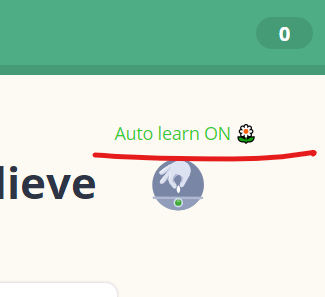

# Memrise Auto Learn

This userscript allows you mark a word as learned whilst in a learning session, to save yourself having to go through all the (usually mandatory) test screens in order for it to become 'planted'.

### Usage

Once installed, if you are on a test screen in a learning session the script will insert an option to auto learn:

To auto learn the word:
1. Check the Auto learn option
2. Submit a correct answer

Once done the session will skip future planting stages and the word will be planted and ready for the normal review scheduling.

### Installation

The easiest method is through the Tampermonkey [chrome extension](https://chrome.google.com/webstore/detail/dhdgffkkebhmkfjojejmpbldmpobfkfo) / [firefox addon](https://addons.mozilla.org/firefox/addon/tampermonkey/).

Then add the script using the following link: https://github.com/cooljingle/memrise-auto-learn/raw/master/Memrise_Auto_Learn.user.js

If you come across any issues or have a suggestion you can leave your feedback in the forum thread: https://community.memrise.com/t/userscript-memrise-auto-learn/11500/1
